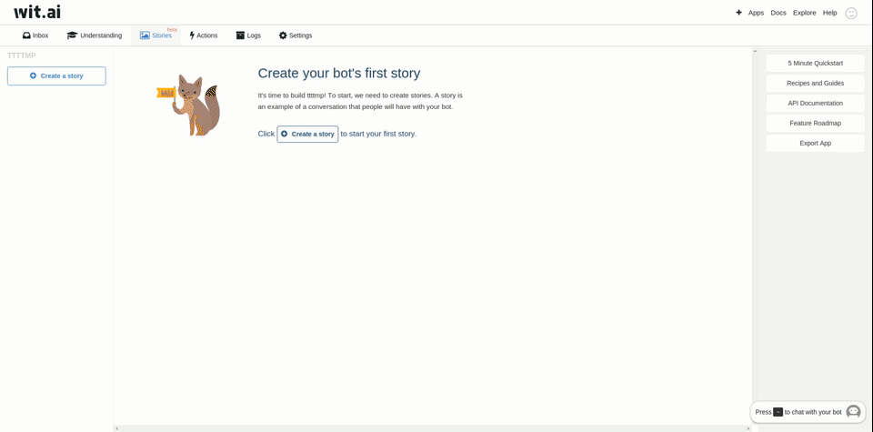
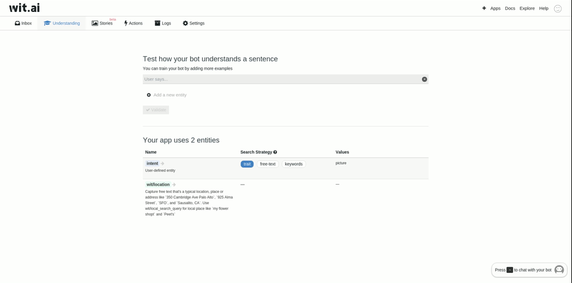

Show-Around: a Wit.ai Powered Facebook Messenger Bot 
====================================================
A Facebook Messenger Bot that will send you pictures of places you're interested in.


If you follow this short tutorial you will do the following:
- Setup a Facebook Messenger bot with Node js
- Integrate Wit.ai to your Bot
- Add stories on Wit.ai

You can try it out [here](#)

I built this simple Bot for learning purposes, if you have any suggestion/fix please feel free to contribute :)

Setup
-----
You can clone this project and use it as a starting point to build your own Bot.

1 - To get started you'll need to create a Facebook App and Page, you can find an up to date How-To guide [here](https://developers.facebook.com/docs/messenger-platform/guides/quick-start) (just follow the App configuration part, no need to write any code yet)

To make your bot work your webhook URL needs to be in https, this is a requirement from facebook, you have many options for hosting your Bot:
- Heroku
- Modulus
- Your own Server, you can install an SSL certificate using Let's encrypt [here's a tutorial for Ubuntu](https://www.digitalocean.com/community/tutorials/how-to-secure-apache-with-let-s-encrypt-on-ubuntu-16-04) 
- Locally using ngrock

2 - Sign up on Wit.ai and create an App. 

3 - Clone this repository:
```
git clone https://github.com/youssef06/show-around.git
```

4 - Install dependencies
```
npm install
```

5 - Create parameters.js:
 This is an environment specific file, it contains all necessary API keys and tokens
```javascript
module.exports = {
    //go to https://developers.facebook.com > your App page > go to Products > Messenger> under 'Token Generation' select your App, then just copy the token
    PAGE_ACCESS_TOKEN: '________',
    // the token you entered in step 1 when setting up your webhooks 
    VALIDATION_TOKEN: '_________',
    //Get this from your Facebook App dashboard
    APP_SECRET: '________',
    //From Google Console, this is used for Image search
    GOOGLE_MAPS_KEY: '________',
    //From the settings page of your Wit.ai App
    WIT_TOKEN: '_________'
};
```

6 - Say hello to your bot!
It should echo back any message you write

Create your Stories
-------------------
We've got our bot setup, but for now all it does is just echo back whatever we write to it, it's still not using Wit.ai, let's fix that.

Create a Wit.ai story:

As explained on Wit.ai: 
> "You will teach Wit by example, and each example conversation is called a Story"

- So let's create a story:

"merge" and "get-image" are actions that are defined in index.js, make sure to comment the sendTextMessage call, and uncomment the block below like this:


```javascript
//echo back the message
//bot.sendTextMessage(senderId, messageText);

// We retrieve the user's current session, or create one if it doesn't exist
// This is needed for our bot to figure out the conversation history
const sessionId = findOrCreateSession(senderId);

// Let's forward the message to the Wit.ai Bot Engine
// This will run all actions until our bot has nothing left to do
wit.runActions(
    sessionId, // the user's current session
    messageText, // the user's message
    sessions[sessionId].context // the user's current session state
).then((context) => {
    //context has been potentially modified by one of our wit actions
    // Our bot did everything it has to do.
    // Now it's waiting for further messages to proceed.
    console.log('Waiting for next user messages');
    console.log('Reinitializing session');
    delete sessions[sessionId];
    // Updating the user's current session state
    //sessions[sessionId].context = context;
}).catch((err) => {
    console.error('Oops! Got an error from Wit: ', err.stack || err);
});
```
If you test your bot again with something like:
```
"Show me a picture of London"
```
It should send you back a picture of London.
- Let's try to help our bot understand more variations:
Go to the "understanding" tab:

 
 Notice that in the 3rd example
 ```
 What's the weather in Manchester?
 ```
 The intent is not to get a photo of Manchester, the more variations we teach it the more accurate our results will be.
 
 
 Todo
 -----
 Add more capabilities to the Bot:
 - Greetings
 - Asking for location if not specified
 - It would be nice to send the user links to Google Street View, that would be better than simple images.
